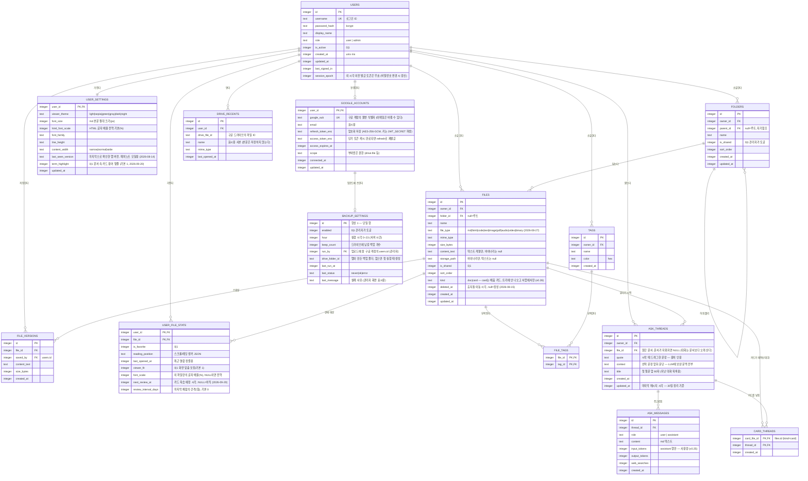

# ERD: docvault

| 작성자 | | 작성일 | 2026-08-13 | 버전 | v0.1 |

## 엔티티 다이어그램

## 엔티티 설명

| 엔티티 | 설명 |
|---|---|
| USERS | 관리자가 발급하는 로컬 계정. 회원가입 경로 없음. 초기 시드로 admin 계정 1개 생성. `session_epoch`는 발급된 세션 토큰을 한꺼번에 무효화하는 장치 — 토큰이 담고 온 값과 다르면 거부한다 |
| FOLDERS | 사용자별 폴더 트리. parent_id 자기참조로 무제한 중첩 |
| FILES | 파일 메타데이터 + 텍스트 본문. 바이너리는 storage_path로 디스크 참조. file_type은 저장·렌더링 방식을 결정: md/html/code/text는 텍스트(DB 본문), image/pdf/audio/video/binary는 바이너리(디스크) |
| FILE_VERSIONS | 편집 저장 시점의 본문 스냅샷. 파일당 최근 20개 유지 |
| TAGS | 사용자별 색상 태그 |
| FILE_TAGS | 파일-태그 다대다 연결 (복합 PK) |
| USER_FILE_STATE | 사용자×파일별 상태: 즐겨찾기, 읽던 위치, 최근 열람, 화면 맞춤 여부. 기기 간 동기화의 핵심 |
| USER_SETTINGS | 뷰어 설정(테마·폰트 등). 서버 저장으로 폰/PC 동일 설정 유지 |
| GOOGLE_ACCOUNTS | 사용자×구글 계정 연결 (1:0..1). 드라이브 문서 열람과 백업 업로드가 이 토큰을 쓴다. **refresh token은 사실상 비밀번호와 같은 힘**을 가지므로 암호화해서 넣는다 — data/ 폴더가 곧 백업 단위라 DB 파일이 밖으로 나갈 수 있다 |
| DRIVE_RECENTS | 드라이브에서 열어 본 문서의 **바로가기 기록**. 이름·형식만 두고 본문은 저장하지 않는다 — 원본은 드라이브에 있고 우리는 볼 때마다 새로 읽는다 |
| BACKUP_SETTINGS | 자동 백업 설정 단일 행. 앱이 스스로 `data/`를 묶어 연결된 구글 드라이브에 올린다. 꺼져 있으면 아무 일도 하지 않는다(기본값 꺼짐) |
| ASK_THREADS | 문서를 읽다 LLM에게 물어본 대화 하나. 어느 문서의 어느 문장에서 시작했는지(quote·context)를 들고 있어, 2판의 카드가 "원 대화"와 "출처"로 쓴다 |
| CARD_THREADS | 카드 ↔ 대화. 한 대화에서 카드 여럿, 한 카드에 대화 여럿(재구성으로 합쳐질 때). 카드가 참조하는 대화는 30일 정리에서 빠진다 |
| ASK_MESSAGES | 대화 속 말풍선 하나. user/assistant 번갈아 쌓인다. 하루 질문 한도는 소유자의 user 행을 UTC 날짜로 센다. assistant 행에는 그 답에 든 토큰·검색 횟수를 적어 두어 관리자 사용량 통계(API-020)의 근거가 된다 |

## 관계 설명

- 사용자 1명은 폴더·파일·태그를 여러 개 소유합니다. 삭제 정책: 사용자 삭제 시 소유 데이터 전체 CASCADE 삭제.
- 폴더는 자기참조(parent_id)로 트리를 구성합니다. 폴더 삭제 시 하위 폴더는 CASCADE 삭제되고, 안의 파일은 folder_id를 끊고 휴지통으로 이동합니다 (2026-08-15 휴지통 도입).
- **휴지통 (2026-08-15)**: FILES.deleted_at(nullable)로 soft delete. null이면 정상, 값이 있으면 휴지통. 휴지통 파일은 모든 목록·검색·접근에서 제외되며(복원·영구삭제 라우트만 예외), 30일 경과 시 서버가 자동 영구 삭제(기동 시 + 일 1회). 휴지통의 파일은 이름을 점유하지 않고, 복원 시 충돌하면 "이름 (2)" 형식으로 자동 개명, 원 폴더가 사라졌으면 최상위로 복원.
- 파일 1개는 버전 스냅샷 여러 개를 가지며, 저장 시 20개 초과분은 오래된 것부터 삭제.
- **화면 맞춤 (2026-08-18)**: viewer_fit은 뷰어가 HTML 문서를 좁은 화면에 맞게 보정할지 여부입니다(기본 1=켬). 문서가 아니라 "이 사람이 이 문서를 어떻게 볼지"의 선택이므로 FILES가 아니라 USER_FILE_STATE에 둡니다 — 같은 공유 문서를 A는 보정해서, B는 원본으로 볼 수 있습니다.
- **글자 크기 2층 구조 (2026-08-18)**: HTML 글자 크기는 USER_SETTINGS.html_font_scale(전역 기본 배율)과 USER_FILE_STATE.font_scale(이 파일만의 배율)로 나뉩니다. font_scale이 **NULL이면 전역을 따르고**, 값이 있으면 그것으로 **대체**합니다(곱하지 않습니다). NULL을 "없음"으로 쓰기 때문에 대부분의 파일은 전역 설정을 바꾸면 같이 따라오고, 유별난 문서만 자기 값을 갖습니다 — 그래서 UI에는 반드시 "기본값 따르기"(= NULL로 되돌리기)가 있어야 합니다. font_scale은 형식을 가리지 않습니다 — HTML은 문서 자신의 크기를 100%로, md·텍스트는 USER_SETTINGS.font_size를 100%로 삼을 뿐 규칙은 같습니다(전역 기본 배율 html_font_scale은 HTML에만 있습니다).
- **복습 (2026-09-20)**: 카드의 복습 상태(next_review_at·review_interval_days)도 USER_FILE_STATE에 둡니다 — 카드는 files의 한 행이고 "이 사람이 이 카드를 얼마나 외웠나"는 사용자×파일 사실이라 즐겨찾기와 같은 자리입니다. NULL이면 아직 복습한 적 없음 = 만든 날 + 1일에 첫 복습. 몰랐다 → 1일, 알았다 → 간격 두 배(2·4·8…60일 상한). 문서(kind=doc) 행에는 늘 NULL입니다.
- **용어 밑줄 (2026-09-20)**: USER_SETTINGS.term_highlight는 문서를 읽을 때 내 배움 카드의 제목·별칭이 나오는 자리에 점선 밑줄을 그을지입니다(기본 1=켬). 읽기 취향이라 기기(localStorage)가 아니라 사람(USER_SETTINGS)에 붙습니다 — 폰에서 끄면 PC에서도 꺼집니다.
- 즐겨찾기·읽던 위치는 파일 속성이 아니라 USER_FILE_STATE(사용자×파일)에 둡니다. 공유 파일을 열람하는 다른 사용자도 자신만의 즐겨찾기·읽던 위치를 가질 수 있게 하기 위한 구조입니다 (기존 Manus 버전에서 파일에 붙어 있던 isFavorite의 개선).
- 공유는 v1에서는 파일/폴더의 is_shared 플래그(전체 사용자 대상 열람 공개, 관리자만 토글)로 구현하고, 추후 특정 사용자 대상 공유가 필요해지면 SHARES(file_id, grantee_id, permission) 테이블로 확장합니다.
- **구글 드라이브 연동 (2026-09-16)**: 연동은 **선택 기능**입니다 — 연결하지 않으면 세 테이블 모두 빈 채로 앱은 완전히 동작합니다(외부 의존 제로 원칙의 유지 방식).
  - GOOGLE_ACCOUNTS는 사용자당 최대 하나(user_id가 PK). 계정 삭제 시 CASCADE로 함께 지워지고, 지울 때 구글 쪽 권한도 회수(revoke)합니다 — 우리 DB에서만 지우면 구글에는 "docvault 접근 허용"이 남습니다.
  - 권한 범위는 `drive.file` 하나입니다. 이 권한은 **사용자가 구글 피커에서 직접 고른 파일**과 **앱이 만든 파일**에만 유효하므로, 드라이브 전체를 훑을 수 없습니다. 대신 구글의 앱 심사·보안 감사 대상이 아닙니다(`drive.readonly`는 restricted scope라 개인 프로젝트로는 통과가 사실상 불가).
  - DRIVE_RECENTS는 FILES와 **섞지 않습니다.** 드라이브 문서는 우리 소유가 아니고 버전·태그·검색·휴지통 어느 것도 걸리지 않아, FILES에 넣으면 그 모든 기능이 "되는 척"하게 됩니다. 별도 테이블은 그 구분을 구조로 못박는 장치입니다. 한 번 고른 파일의 접근 권한은 계속 유효하므로 이 목록에서 다시 열 수 있고, 원본이 드라이브에서 지워지면 열 때 404로 드러납니다(목록이 먼저 알지 못합니다).
  - BACKUP_SETTINGS의 run_by는 업로드에 쓸 구글 계정입니다. 관리자 계정이어야 하고, 그 관리자가 연결을 해제하면 백업은 자동으로 꺼집니다(토큰 없이 켜져 있으면 매일 조용히 실패합니다).
- **질문 대화 (2026-09-18, 배움 카드 1판)**: ASK_THREADS.file_id는 **SET NULL**이다 — 문서를 지워도 대화는 남는다(설계 흐름 D: 카드는 문서보다 오래 산다). 대화는 저장 버튼 없이 자동 보관되고, updated_at이 30일 지나면 서버가 정리한다(휴지통과 같은 주기). 2판부터 카드가 참조하는 대화는 정리 대상에서 뺀다. context 컬럼은 "LLM에 무엇을 보냈나"의 기록이기도 하다 — 문서 전체가 아니라 이 컬럼의 내용만 나간다. 소유자 삭제 시 CASCADE.
- **배움 카드 (2026-09-18, v0.26)**: 카드는 FILES의 md 행이다(`kind='card'`). 별도 테이블을 만들지 않은 이유 — 편집·버전·태그·검색·공유·백업이 전부 FILES에 걸려 있어, 카드를 따로 두면 그 모든 기능을 다시 만들어야 한다. 대신 `kind`로 **파일 트리에서만 뺀다**(문서와 섞이면 구분이 안 된다). 카드의 머리말(한 줄·별칭·종류·주제·태그·연결·출처)은 컬럼이 아니라 **본문 맨 위의 frontmatter**에 있다 — 사람이 편집기에서 고칠 수 있어야 하고, 목록은 수백 장까지 매번 파싱해도 싸다. 제목은 파일 이름이다(두 군데 두지 않는다). CARD_THREADS는 카드가 어느 대화에서 왔는지 — 대화 정리 예외와 "원 대화 보기"의 근거.
- **전량 수용 정책 (2026-08-27)**: 업로드는 확장자를 거절하지 않고 **분류**합니다. 아는 텍스트 확장자(md/html/코드류/txt) → 해당 타입, 모르는 확장자는 내용을 검사해(UTF-8 · NUL 없음 · 10MB 이하) 텍스트면 text, 아니면 binary. 오디오·비디오는 audio/video 타입으로 디스크 저장. binary는 미리보기 없이 보관·다운로드만 지원합니다. file_type의 enum은 Drizzle 스키마의 TS 타입 제약이며 SQLite에는 CHECK 제약을 두지 않으므로 값 추가에 마이그레이션이 필요 없습니다.

## 비고

- 타임스탬프는 전부 unix epoch 밀리초 정수(UTC)로 저장하고 표시 시점에 로컬 변환합니다.
- 전문 검색용 FTS5 가상 테이블 `files_fts(name, content_text)`는 ERD에는 표시하지 않는 파생 인덱스이며, FILES 변경 시 트리거로 동기화합니다.
- 컬럼별 상세 제약·기본값은 구현 시 테이블 정의서(데이터 사전)로 별도 문서화할 수 있습니다.
