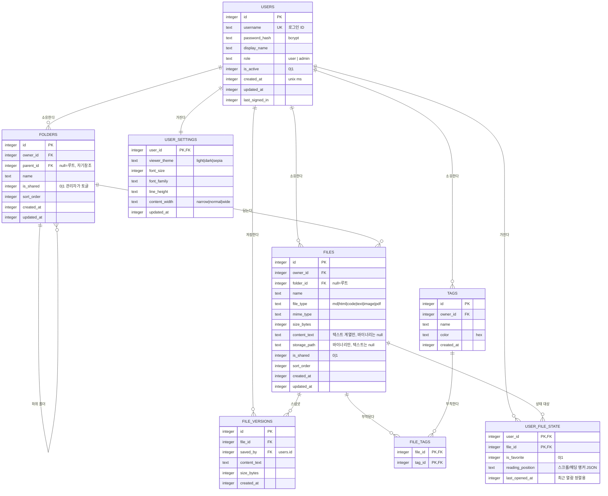

# ERD: docvault

| 작성자 | | 작성일 | 2026-08-13 | 버전 | v0.1 |

## 엔티티 다이어그램

## 엔티티 설명

| 엔티티 | 설명 |
|---|---|
| USERS | 관리자가 발급하는 로컬 계정. 회원가입 경로 없음. 초기 시드로 admin 계정 1개 생성 |
| FOLDERS | 사용자별 폴더 트리. parent_id 자기참조로 무제한 중첩 |
| FILES | 파일 메타데이터 + 텍스트 본문. 바이너리는 storage_path로 디스크 참조 |
| FILE_VERSIONS | 편집 저장 시점의 본문 스냅샷. 파일당 최근 20개 유지 |
| TAGS | 사용자별 색상 태그 |
| FILE_TAGS | 파일-태그 다대다 연결 (복합 PK) |
| USER_FILE_STATE | 사용자×파일별 상태: 즐겨찾기, 읽던 위치, 최근 열람. 기기 간 동기화의 핵심 |
| USER_SETTINGS | 뷰어 설정(테마·폰트 등). 서버 저장으로 폰/PC 동일 설정 유지 |

## 관계 설명

- 사용자 1명은 폴더·파일·태그를 여러 개 소유합니다. 삭제 정책: 사용자 삭제 시 소유 데이터 전체 CASCADE 삭제.
- 폴더는 자기참조(parent_id)로 트리를 구성합니다. 폴더 삭제 시 하위 폴더는 CASCADE 삭제되고, 안의 파일은 folder_id를 끊고 휴지통으로 이동합니다 (2026-08-15 휴지통 도입).
- **휴지통 (2026-08-15)**: FILES.deleted_at(nullable)로 soft delete. null이면 정상, 값이 있으면 휴지통. 휴지통 파일은 모든 목록·검색·접근에서 제외되며(복원·영구삭제 라우트만 예외), 30일 경과 시 서버가 자동 영구 삭제(기동 시 + 일 1회). 휴지통의 파일은 이름을 점유하지 않고, 복원 시 충돌하면 "이름 (2)" 형식으로 자동 개명, 원 폴더가 사라졌으면 최상위로 복원.
- 파일 1개는 버전 스냅샷 여러 개를 가지며, 저장 시 20개 초과분은 오래된 것부터 삭제.
- 즐겨찾기·읽던 위치는 파일 속성이 아니라 USER_FILE_STATE(사용자×파일)에 둡니다. 공유 파일을 열람하는 다른 사용자도 자신만의 즐겨찾기·읽던 위치를 가질 수 있게 하기 위한 구조입니다 (기존 Manus 버전에서 파일에 붙어 있던 isFavorite의 개선).
- 공유는 v1에서는 파일/폴더의 is_shared 플래그(전체 사용자 대상 열람 공개, 관리자만 토글)로 구현하고, 추후 특정 사용자 대상 공유가 필요해지면 SHARES(file_id, grantee_id, permission) 테이블로 확장합니다.

## 비고

- 타임스탬프는 전부 unix epoch 밀리초 정수(UTC)로 저장하고 표시 시점에 로컬 변환합니다.
- 전문 검색용 FTS5 가상 테이블 `files_fts(name, content_text)`는 ERD에는 표시하지 않는 파생 인덱스이며, FILES 변경 시 트리거로 동기화합니다.
- 컬럼별 상세 제약·기본값은 구현 시 테이블 정의서(데이터 사전)로 별도 문서화할 수 있습니다.
