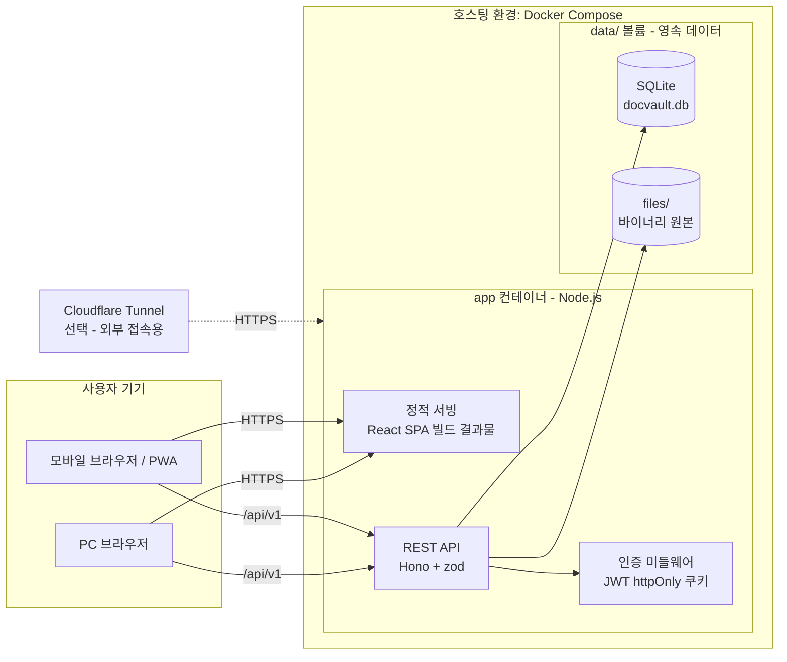

# 시스템 아키텍처: docvault

| 작성자 | | 작성일 | 2026-08-13 | 버전 | v0.1 |

## 개요

docvault는 관리자가 계정을 발급하는 폐쇄형 문서 열람·편집 플랫폼입니다. MD/HTML에서 시작해 코드, 이미지, PDF 등으로 지원 형식을 확장해나갑니다. 특정 호스팅에 종속되지 않는 포터블 구조(Docker Compose 단일 패키지)를 최우선 설계 원칙으로 합니다.

## 구성도

## 구성요소 설명

| 구성요소 | 역할 | 기술 스택 |
|---|---|---|
| 클라이언트 (SPA) | 파일 탐색기, 뷰어, 편집기, 관리자 UI. PWA 매니페스트로 모바일 홈 화면 설치 지원 | React 19, Vite, Tailwind CSS 4, shadcn/ui |
| 뷰어 렌더러 레지스트리 | fileType별 렌더러 컴포넌트 매핑(md, html, code, image, pdf...). 새 형식 추가 시 렌더러만 등록하면 되는 플러그인 구조 | react-markdown(remark-gfm, rehype-highlight), iframe sandbox, highlight.js |
| API 서버 | 인증, 파일/폴더 CRUD, 버전 관리, 태그, 공유, 검색 등 비즈니스 로직 | Node.js 22 LTS, Hono, zod(입력 검증) |
| 인증 계층 | 관리자 발급형 로컬 계정. bcrypt 해시 + JWT를 httpOnly 쿠키로 발급 | bcryptjs, jose |
| SQLite DB | 모든 메타데이터 + 텍스트 파일 본문 + 버전 스냅샷. FTS5 가상 테이블로 전문 검색 | SQLite(better-sqlite3), Drizzle ORM |
| 디스크 스토리지 | 이미지·PDF 등 바이너리 원본 저장. `data/files/{ownerId}/{uuid}` 경로 규칙 | 로컬 파일시스템 (Docker 볼륨) |
| Cloudflare Tunnel (선택) | 외부(폰) 접속 시 무료 HTTPS 터널. 앱과 독립적이며 없어도 동작 | cloudflared |

## 주요 흐름 / 설명

**파일 열람**: 클라이언트가 `GET /api/v1/files/{id}/content` 호출 → 인증 미들웨어가 쿠키의 JWT 검증 → 권한 검사(소유자, 공유 파일, 또는 관리자) → 텍스트 파일이면 DB의 `content_text` 반환, 바이너리면 디스크에서 스트리밍. 클라이언트는 fileType에 맞는 렌더러로 표시합니다.

**편집 저장**: `PUT /files/{id}/content` → 저장 전 현재 내용을 `file_versions`에 스냅샷(파일당 최근 20개 유지, 초과분 삭제) → 본문 갱신. 실패 시 스냅샷과 본문을 한 트랜잭션으로 롤백합니다.

**멀티 디바이스 동기화**: 기존 Manus 버전에서 localStorage에 있던 즐겨찾기·읽던 위치·최근 열람·뷰어 설정을 전부 서버(DB)로 이동합니다. 폰에서 읽던 문서를 PC에서 이어 읽는 것이 목표이므로 기기 로컬 상태는 캐시로만 사용합니다.

**검색**: 업로드·저장 시 파일명과 텍스트 본문을 FTS5 인덱스에 반영. `GET /search?q=`가 이름+본문 통합 검색을 제공합니다.

## 비기능 고려사항

- **포터빌리티**: 외부 서비스 의존 제로. `docker compose up` 하나로 로컬 PC, Oracle/GCP 무료 VPS, 집 서버 어디서든 동일하게 실행. 호스팅 이사는 `data/` 폴더 복사로 끝납니다.
- **백업**: 영속 데이터가 `data/` 볼륨 하나에 모여 있으므로 폴더 압축 복사가 곧 전체 백업. 추후 cron + rclone 등으로 자동화 가능.
- **보안 경계**: 회원가입 없는 폐쇄형. 비밀번호는 bcrypt, 세션은 httpOnly + SameSite=Lax 쿠키(XSS/CSRF 기본 방어). HTML 파일 렌더링은 iframe sandbox로 격리. 외부 노출 시 HTTPS는 Tunnel 또는 Caddy가 담당.
- **HTML 렌더러 호환 심 (결정 사항)**: srcdoc 문서는 base URL을 부모 페이지에서 물려받아, 문서 안 `#앵커` 클릭이 문서 내 스크롤이 아니라 앱 URL로의 iframe 내비게이션(흰 화면)이 된다. 렌더러가 주입하는 심(shim) 스크립트가 ① 앵커 클릭을 가로채 `scrollIntoView`로 변환하고 ② 스크롤 위치(`docvault:scroll`)와 헤딩 목록(`docvault:toc`)을 `postMessage`로 부모에 보고해 이어 읽기·목차(SCR-151)를 지원하며 ③ 부모가 보내는 이동(`docvault:goto`)·테마(`docvault:theme`) 메시지를 수행한다. 테마는 문서 `<html>`에 `data-theme` 표식만 남기는 opt-in 방식 — 문서가 CSS로 따를지 선택하고, 강제 변환은 하지 않는다. 격리 원칙 유지: iframe↔부모 통신은 postMessage 한 통로뿐이며, 부모는 `e.source`가 해당 iframe인 메시지만 신뢰한다.
- **폰트 자가 호스팅 (결정 사항)**: 문서 글꼴 Pretendard(SIL OFL 1.1)를 `client/public/fonts/`에 동봉해 `/fonts/pretendard.css`로 서빙한다 — "외부 서비스 의존 제로" 원칙의 연장이며, srcdoc이 base URL을 부모에게서 물려받는 특성 덕에 문서 속 루트 경로 참조가 그대로 docvault 서버를 가리킨다. 폰트는 CORS 필수 자원이라 격리 오리진(문서 iframe)이 가져갈 수 있도록 `/fonts/*` 응답에 `Access-Control-Allow-Origin: *`를 붙인다(dev는 Vite 헤더, 운영은 Hono 미들웨어). 문서 쪽은 CDN 링크를 폴백으로 유지해 docvault 밖에서 열어도 동작한다.
- **확장 로드맵**: (1) 렌더러 레지스트리에 형식 추가 → (2) 업로드 허용 확장자·MIME 화이트리스트 갱신 → (3) 필요 시 텍스트 추출기(예: PDF 텍스트)를 붙여 검색 인덱스 확장. 서버 구조 변경 없이 형식이 늘어나는 것을 목표로 합니다.
- **저장 전략 (결정 사항)**: 텍스트 계열(md, html, code, txt)은 DB 본문 저장(빠른 조회·버전 관리·검색에 유리), 바이너리(이미지, PDF)는 디스크 저장 + DB에는 경로만. "DB 단독" 초기 결정을 형식 확장 계획에 맞춰 하이브리드로 조정했습니다.
