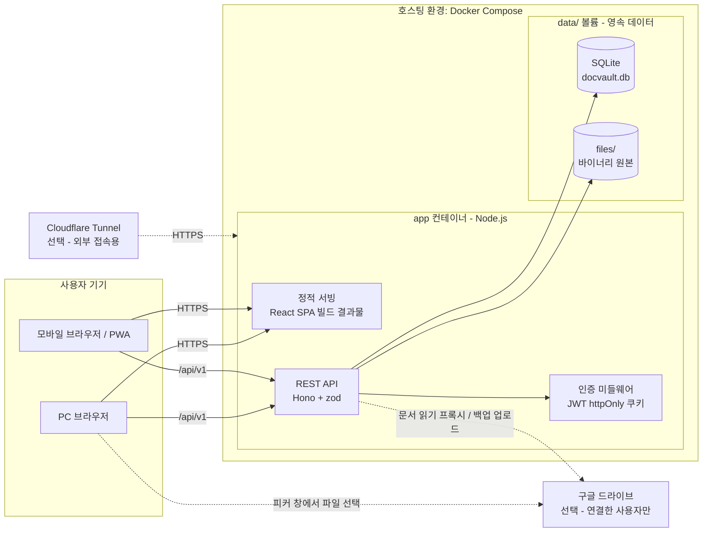

# 시스템 아키텍처: docvault

| 작성자 | | 작성일 | 2026-08-13 | 버전 | v0.1 |

## 개요

docvault는 관리자가 계정을 발급하는 폐쇄형 문서 열람·편집 플랫폼입니다. MD/HTML에서 시작해 코드, 이미지, PDF 등으로 지원 형식을 확장해나갑니다. 특정 호스팅에 종속되지 않는 포터블 구조(Docker Compose 단일 패키지)를 최우선 설계 원칙으로 합니다.

## 구성도

## 구성요소 설명

| 구성요소 | 역할 | 기술 스택 |
|---|---|---|
| 클라이언트 (SPA) | 파일 탐색기, 뷰어, 편집기, 관리자 UI. PWA 매니페스트로 모바일 홈 화면 설치 지원 | React 19, Vite, Tailwind CSS 4, shadcn/ui |
| 뷰어 렌더러 레지스트리 | fileType별 렌더러 컴포넌트 매핑(md, html, code, image, pdf, audio, video...). 새 형식 추가 시 렌더러만 등록하면 되는 플러그인 구조. 미리보기 불가 형식(binary)은 다운로드 카드로 표시 | react-markdown(remark-gfm, rehype-highlight), iframe sandbox, highlight.js |
| API 서버 | 인증, 파일/폴더 CRUD, 버전 관리, 태그, 공유, 검색 등 비즈니스 로직 | Node.js 22 LTS, Hono, zod(입력 검증) |
| 인증 계층 | 관리자 발급형 로컬 계정. bcrypt 해시 + JWT를 httpOnly 쿠키로 발급 | bcryptjs, jose |
| SQLite DB | 모든 메타데이터 + 텍스트 파일 본문 + 버전 스냅샷. FTS5 가상 테이블로 전문 검색 | SQLite(better-sqlite3), Drizzle ORM |
| 디스크 스토리지 | 이미지·PDF 등 바이너리 원본 저장. `data/files/{ownerId}/{uuid}` 경로 규칙 | 로컬 파일시스템 (Docker 볼륨) |
| Cloudflare Tunnel (선택) | 외부(폰) 접속 시 무료 HTTPS 터널. 앱과 독립적이며 없어도 동작 | cloudflared |
| 구글 드라이브 연동 (선택) | 드라이브 문서 열람(사본 없음) + `data/` 자동 백업 업로드. 계정을 연결하지 않으면 앱에 존재하지 않는 것과 같다 | Google OAuth 2.0(`drive.file`), Drive API v3, Google Picker |

## 주요 흐름 / 설명

**파일 열람**: 클라이언트가 `GET /api/v1/files/{id}/content` 호출 → 인증 미들웨어가 쿠키의 JWT 검증 → 권한 검사(소유자, 공유 파일, 또는 관리자) → 텍스트 파일이면 DB의 `content_text` 반환, 바이너리면 디스크에서 스트리밍. 클라이언트는 fileType에 맞는 렌더러로 표시합니다.

**편집 저장**: `PUT /files/{id}/content` → 저장 전 현재 내용을 `file_versions`에 스냅샷(파일당 최근 20개 유지, 초과분 삭제) → 본문 갱신. 실패 시 스냅샷과 본문을 한 트랜잭션으로 롤백합니다.

**멀티 디바이스 동기화**: 기존 Manus 버전에서 localStorage에 있던 즐겨찾기·읽던 위치·최근 열람·뷰어 설정을 전부 서버(DB)로 이동합니다. 폰에서 읽던 문서를 PC에서 이어 읽는 것이 목표이므로 기기 로컬 상태는 캐시로만 사용합니다.

**드라이브 문서 열람 (2026-09-16)**: 사용자가 구글 피커에서 문서를 고르면 → 클라이언트는 **파일 ID만** 받아 `GET /api/v1/google/files/{id}/content`를 호출 → 서버가 저장해 둔 refresh token으로 access token을 얻어 **대신 읽어** 온다(프록시) → 구글 전용 형식은 export로 md·CSV·PDF로 바꾸고, 일반 파일은 기존 `filetypes.ts` 분류를 그대로 태운다 → 기존 렌더러 레지스트리가 그린다. **본문은 어디에도 저장하지 않는다** — 남는 것은 DRIVE_RECENTS의 바로가기 한 줄뿐이다.

**자동 백업 (2026-09-16)**: 앱 안의 스케줄러가 매일 지정 시각에 `data/`를 tar.gz로 묶어 관리자의 드라이브에 올리고, 보관 개수를 넘는 오래된 것을 지운다. 기존 `scripts/backup.sh`(서버 디스크에 쌓기)를 대체하지 않고 **한 칸 더 멀리 두는** 것이다 — 백업이 원본과 같은 디스크에 있으면 디스크가 죽을 때 같이 죽는다.

**검색**: 업로드·저장 시 파일명과 텍스트 본문을 FTS5 인덱스에 반영. `GET /search?q=`가 이름+본문 통합 검색을 제공합니다.

## 비기능 고려사항

- **포터빌리티**: 외부 서비스 의존 제로. `docker compose up` 하나로 로컬 PC, Oracle/GCP 무료 VPS, 집 서버 어디서든 동일하게 실행. 호스팅 이사는 `data/` 폴더 복사로 끝납니다.
- **백업**: 영속 데이터가 `data/` 볼륨 하나에 모여 있으므로 폴더 압축 복사가 곧 전체 백업. **2026-09-16부터 앱 자체가 이것을 구글 드라이브로 올릴 수 있다**(관리자 설정, 기본 꺼짐) — cron + rclone을 밖에 붙이는 대신 앱 안에 넣은 이유는 "설정 화면에서 켜고 결과를 볼 수 있어야 실제로 켜 둔다"이다.
- **외부 서비스 의존 제로 원칙과 구글 연동 (결정 사항, 2026-09-16)**: 드라이브 연동은 이 문서 첫 줄의 원칙과 정면으로 부딪힌다. 그래서 **원칙을 깨는 대신 경계를 긋는다** — 연동은 전부 opt-in이고, 연결하지 않은 설치본은 코드가 있다는 사실조차 화면에 드러나지 않으며(레일 패널이 안 나옴), 드라이브가 죽어도 docvault의 어떤 기존 기능도 멈추지 않는다. **드라이브에 우리 데이터의 유일한 사본이 놓이는 경우도 없다**(백업은 사본을 하나 더 두는 것이지 옮기는 것이 아니다). 판정 기준: *"구글이 내일 이 API를 없애면 docvault는 계속 쓸 수 있는가?"* — 답이 예인 동안만 이 연동을 유지한다.
- **구글 권한 범위 (결정 사항, 2026-09-16)**: `drive.file` 하나만 받는다. 이 범위는 **사용자가 구글 피커에서 고른 파일**과 **앱이 만든 파일**에만 유효하다. 더 넓은 `drive.readonly`는 구글의 *restricted scope*라 앱 심사 + 외부 보안 감사(CASA)를 통과해야 하고 개인 프로젝트로는 사실상 불가능하다. 이 제약이 UX를 규정한다 — **드라이브 폴더 트리를 우리 UI로 그릴 수 없고**, 탐색·검색은 구글 피커가 맡는다. 제약을 우회하려 들지 않고 화면 설계를 제약에 맞춘다(IA SCR-135).
- **구글 토큰 보관 (결정 사항, 2026-09-16)**: refresh token은 만료가 없어 사실상 그 계정의 드라이브 열쇠다. `data/` 폴더가 곧 백업 단위이고 백업이 드라이브로 나가므로, **DB 파일이 밖으로 나가는 것을 전제**로 설계한다 — refresh token과 access token은 `JWT_SECRET`에서 파생한 키로 AES-256-GCM 암호화해 저장한다(열쇠와 자물쇠를 다른 곳에 둔다: 토큰은 `data/`, 키는 환경변수). **access token은 구글 피커 구동에 필요한 1회분만 브라우저로 내려가고, refresh token은 어떤 경로로도 클라이언트에 노출되지 않는다.** 연결 해제 시 구글 쪽 권한까지 revoke한다 — 우리 DB에서만 지우면 구글 계정에는 허용이 남는다.
- **보안 경계**: 회원가입 없는 폐쇄형. 비밀번호는 bcrypt, 세션은 httpOnly + SameSite=Lax 쿠키(XSS/CSRF 기본 방어). HTML 파일 렌더링은 iframe sandbox로 격리. 외부 노출 시 HTTPS는 Tunnel 또는 Caddy가 담당.
- **HTML 렌더러 호환 심 (결정 사항)**: srcdoc 문서는 base URL을 부모 페이지에서 물려받아, 문서 안 `#앵커` 클릭이 문서 내 스크롤이 아니라 앱 URL로의 iframe 내비게이션(흰 화면)이 된다. 렌더러가 주입하는 심(shim) 스크립트가 ① 앵커 클릭을 가로채 `scrollIntoView`로 변환하고 ② 스크롤 위치(`docvault:scroll`)와 헤딩 목록(`docvault:toc`)을 `postMessage`로 부모에 보고해 이어 읽기·목차(SCR-151)를 지원하며 ③ 부모가 보내는 이동(`docvault:goto`)·테마(`docvault:theme`) 메시지를 수행한다. 테마는 문서 `<html>`에 `data-theme` 표식만 남기는 opt-in 방식 — 문서가 CSS로 따를지 선택하고, 강제 변환은 하지 않는다. 격리 원칙 유지: iframe↔부모 통신은 postMessage 한 통로뿐이며, 부모는 `e.source`가 해당 iframe인 메시지만 신뢰한다.
- **모바일 화면 맞춤 (결정 사항)**: 올라오는 HTML은 docvault를 모르고 만들어진 남의 문서다. 따라서 "문서를 뷰어에 맞게 고쳐라"가 아니라 **뷰어가 어떤 문서든 좁은 화면에 맞춘다**를 원칙으로 한다. 심이 주입하는 맞춤 로직은 넘칠 때만, 단계적으로 개입한다 — ① 가로 넘침 감지(`scrollWidth > clientWidth`) ② 이미지·SVG·영상에 `max-width:100%` 가드 CSS ③ 그래도 넘치면 **가두고 → 넘치는 것만 스크롤 상자로** 두 걸음: ⓐ 넘치는 요소(폭이 넓은 것 + **오른쪽으로 밀려난 것**)를 전부 `box-sizing:border-box` + `max-width:100%`로 화면 폭 안에 가두고 조상 사슬에 `min-width:0`을 준다(grid/flex의 `1fr`은 내용물의 min-content보다 못 줄어들기 때문), ⓑ 가둔 뒤에도 제 안에서 내용이 넘치는 요소(`scrollWidth > clientWidth`)만 **안쪽부터** `overflow-x:auto`로 만든다 ④ 그래도 넘치면 `zoom`으로 전체를 축소(하한 0.5).
  - ③에서 "가장 안쪽이 범인"이라는 짐작 대신 두 걸음으로 나눈 것은 실측의 결과다. 한 놈만 고르면 **고정 `width`를 가진 바깥 상자**(신문형 레이아웃)와 **폭은 좁지만 오른쪽으로 밀려난 형제**(다단 배치)를 놓치고, 스크롤을 맡아야 할 진짜 상자는 **제 상자는 멀쩡하고 자식만 삐져나오는 부모**라서 애초에 검출 목록에 없다. 그래서 스크롤 후보에는 조상도 포함한다. `box-sizing`을 같이 주지 않으면 `max-width:100%`가 내용 상자 기준이라 좌우 여백만큼 그대로 넘친다.
  - 문서가 로드 후에 본문을 그리는 경우(스크립트가 붙이는 표·목록)를 위해 `MutationObserver`로 자식 변화를 지켜보고 다시 계산한다. **속성 변화는 보지 않는다** — 우리가 덧씌우는 인라인 스타일이 스스로를 다시 부르기 때문이다. DOM은 건드리지 않고 인라인 스타일만 덧씌운다 — 요소를 감싸면 문서의 `>`·`:nth-child` 선택자가 깨지기 때문이며, 되돌리기 위해 덧씌운 값의 원래 값을 기록해 둔다. 문서가 넓게 보이도록 의도된 경우를 위해 파일별 토글(USER_FILE_STATE.viewer_fit)로 끌 수 있고, 끄면 기록해 둔 원래 값으로 복원한다.
- **스크롤 상자 메모리 가드 (결정 사항, 2026-09-15)**: iOS WebKit은 가로로 넘치는 스크롤 상자(`overflow-x:auto`)마다 합성 레이어를 따로 두며, 레티나(3배)에서는 한 장이 수 MB다. 터미널 블록 141개 + 표 17개(넘치는 상자 158개, 레이어 추정 최대 약 1.3GB)인 HTML 문서가 아이폰에서 탭 메모리 한도를 넘겨 반복 강제 종료됐고("문제가 반복적으로 발생했습니다"), 같은 문서의 터미널 블록만 줄바꿈시킨 사본(상자 17개)은 정상으로 열렸다. 앱은 다시 켜면 마지막 문서를 열므로 한 번 걸리면 빠져나올 수 없다 — 그래서 이 가드는 화면 맞춤 토글과 **무관하게 터치 기기에서 항상** 동작한다. 규칙: 넘치는 스크롤 상자가 `HTML_SCROLLER_LIMIT`(30, `client/src/lib/constants.ts`)을 넘으면 줄바꿈이 가능한 상자(`white-space`가 normal이 아닌 코드형이면서 표를 품지 않은 것)만 인라인 스타일로 `pre-wrap` + `overflow-wrap:anywhere` + `overflow-x:visible`로 바꾼다. 표는 줄바꿈하면 칸이 무너지므로 스크롤 상자로 남기고, PC는 메모리가 넉넉하므로 문서를 만든 그대로 둔다. 한 번 줄바꿈한 상자는 되돌리지 않는다(되돌리면 다시 레이어가 되어 한도를 넘는다).
- **글자 크기 배율 (결정 사항)**: md는 우리가 그리므로 전역 크기는 절대 px(USER_SETTINGS.font_size)로 충분하지만, HTML은 문서마다 자기 기준 크기를 px로 갖고 있어(어떤 정독본은 본문 15px, 어떤 건 14px) 절대값을 강요하면 문서마다 결과가 다르고 제목·본문의 위계가 뭉개진다. 그래서 HTML은 **배율(%)** 로 다룬다. 구현은 문서의 스타일 규칙을 CSSOM으로 읽어 `font-size`의 **px·pt 값만** 배율을 곱한 **사본 시트**를 만들어 문서 맨 뒤에 덧붙이는 방식이다 — 선택자를 그대로 베끼므로 원래의 캐스케이드(위계)가 보존되고, 되돌리기가 시트 한 장 제거다. `em`·`rem`·`%`는 부모(또는 루트)에 비례하는 값이라 **일부러 건드리지 않는다**(부모가 커지면 저절로 따라 커지므로, 손대면 두 번 곱해진다). 대신 rem의 기준인 루트 크기는 함께 키운다. 읽을 수 없는 외부(CDN) 시트는 건너뛰고, 시트보다 센 인라인 `style="font-size:…"`만 따로 덧씌운다. SVG의 `font-size` **속성**은 그림의 일부라 손대지 않는다. 값은 **전역 기본(USER_SETTINGS.html_font_scale) + 파일별 덮어쓰기(USER_FILE_STATE.font_scale, NULL이면 전역을 따름)** 2층 구조이며, 곱이 아니라 대체다. 글자가 커지면 표·코드가 다시 넘치므로 배율 변경 뒤에는 화면 맞춤을 처음부터 다시 계산한다(순서: 배율 → 메모리 가드 → 맞춤 → 읽던 위치 복원). **파일별 조절은 md·텍스트에도 준다(2026-08-18)** — 다만 여기서는 문서가 자기 크기를 갖지 않으므로 배율의 기준(100%)이 곧 USER_SETTINGS.font_size이고, 뷰어는 그 px에 USER_FILE_STATE.font_scale을 곱한 값을 본문 컨테이너에 건다. 안쪽(prose)이 전부 em/rem이라 제목·본문 위계는 저절로 따라온다. 즉 배율이라는 단위와 "NULL=전역을 따름" 규칙은 형식 공통이고, 형식마다 다른 것은 100%의 기준(HTML=문서 자신, md=설정의 px)뿐이다.
- **내보내기 (결정 사항)**: 텍스트는 DB에, 바이너리는 디스크에 나뉘어 있으므로(저장 전략) 내보내기는 폴더를 압축하는 일이 아니라 두 출처에서 파일을 되살려 조립하는 일이다. `server/src/lib/archive.ts`가 요청 범위(선택·폴더·전체)를 담을 파일 목록으로 펼치고 ZIP을 **스트리밍**으로 만든다 — 전체를 메모리에 쌓지 않으므로 파일이 많아도 견디고, 대신 Content-Length는 알 수 없다. 클라이언트는 fetch로 받아 Blob을 만들지 않고 주소만 열어(`<a href>`) 브라우저가 디스크로 바로 흘리게 한다. 권한은 담기는 항목마다 `canReadFile`/`canReadFolder`로 개별 검사하고, 권한 없는 항목은 오류 대신 조용히 제외한다(있는지 없는지조차 알려주지 않기 위해). 백업 스크립트(`scripts/backup.sh`)와는 목적이 다르다 — 그쪽은 복원용 원본 덩어리, 이쪽은 사람이 열어보는 파일 묶음.
- **폰트 자가 호스팅 (결정 사항)**: 문서 글꼴 Pretendard(SIL OFL 1.1)를 `client/public/fonts/`에 동봉해 `/fonts/pretendard.css`로 서빙한다 — "외부 서비스 의존 제로" 원칙의 연장이며, srcdoc이 base URL을 부모에게서 물려받는 특성 덕에 문서 속 루트 경로 참조가 그대로 docvault 서버를 가리킨다. 폰트는 CORS 필수 자원이라 격리 오리진(문서 iframe)이 가져갈 수 있도록 `/fonts/*` 응답에 `Access-Control-Allow-Origin: *`를 붙인다(dev는 Vite 헤더, 운영은 Hono 미들웨어). 문서 쪽은 CDN 링크를 폴백으로 유지해 docvault 밖에서 열어도 동작한다.
- **확장 로드맵 → 전량 수용 정책 (2026-08-27 개정)**: 화이트리스트를 늘려가는 로드맵을 종료하고, 업로드는 모든 확장자를 받되 **분류**하는 방식으로 전환. 아는 확장자는 형식 맵(`filetypes.ts`)으로, 모르는 확장자는 내용 검사(UTF-8·NUL 없음·10MB 이하 → text, 아니면 binary)로 분류합니다. 새 형식의 "미리보기"가 필요해지면 (1) 형식 맵에 확장자 추가 → (2) 렌더러 레지스트리에 컴포넌트 등록 두 단계는 그대로 유효합니다. 필요 시 텍스트 추출기(예: PDF 텍스트)를 붙여 검색 인덱스를 확장하는 것도 여전히 열려 있습니다.
- **저장 전략 (결정 사항)**: 텍스트 계열(md, html, code, text)은 DB 본문 저장(빠른 조회·버전 관리·검색에 유리), 바이너리(image, pdf, audio, video, binary)는 디스크 저장 + DB에는 경로만. "DB 단독" 초기 결정을 형식 확장 계획에 맞춰 하이브리드로 조정했습니다.
- **바이너리 서빙 보안 (2026-08-27)**: /raw는 항상 `X-Content-Type-Options: nosniff`를 보내고, 미리보기 없는 binary 형식은 `Content-Disposition: attachment`로 내려 브라우저가 문서로 열지 않게 합니다(HTML·SVG의 CSP sandbox 격리와 같은 원칙 — 사용자가 올린 파일은 앱의 출처에서 실행되지 않는다).
